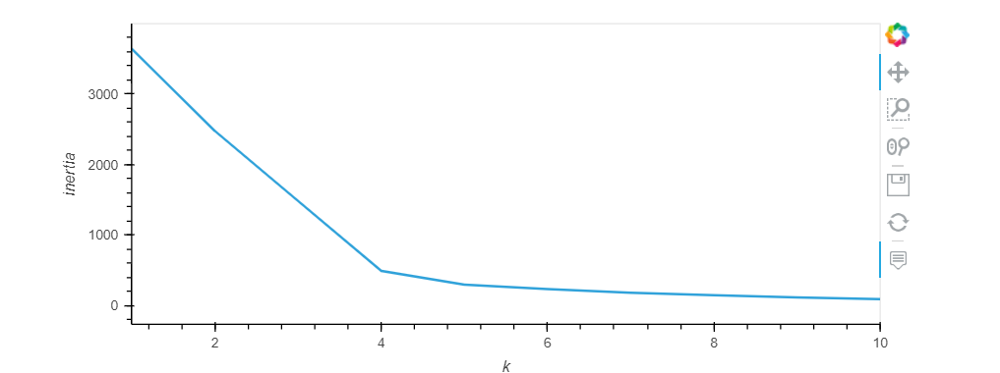
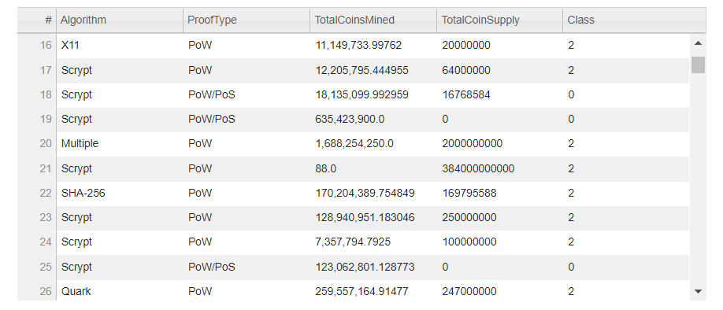
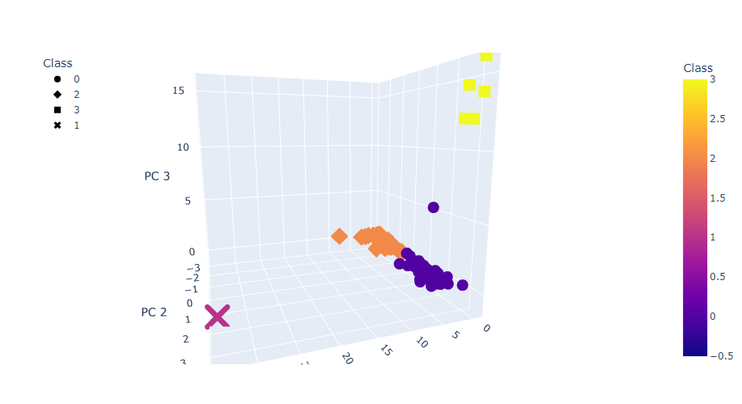
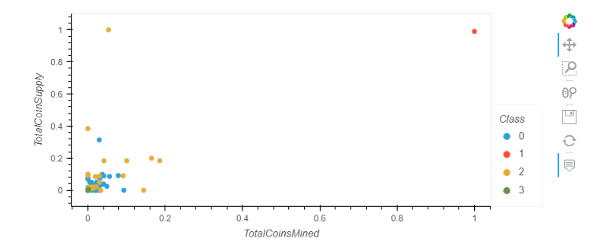

# Credit_Risk_Analysis

## Overview
Accountability Accounting, a prominent investment bank, is interested in offering a new cryptocurrency investment portfolio for its customers. The company, however, is lost in the vast universe of cryptocurrencies. They have asked us to create a report that includes what cryptocurrencies are on the trading market and how they could be grouped to create a classification system for this new investment. Since there is no known output for what they are looking for we will be utilizing unsupervised machine learning to gather the data into usable results

## Analysis

- Preprocess the Data for PCA
- Reduce Data Dimensions Using PCA
- Cluster Cryptocurrencies Using K-means
- Visualize Cryptocurrencies Results

## Visualization

After processing the data with the above steps we achieved the following output visualizations.

We created an Elbow Curve chart that shows the initial point is at 4 clusters.

This table represents the tradable cryptocurrencies

We further visualize the data creating a 3D plot to visualize the 4 Classes of currency.

Lastly we created a scatter plot that shows the different CoinNames and Algorithms upon hover.

